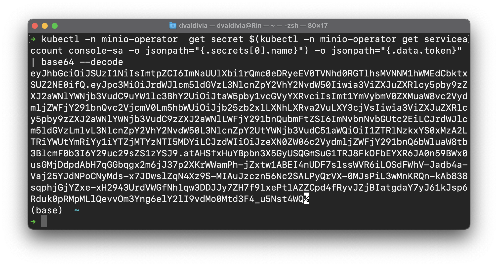
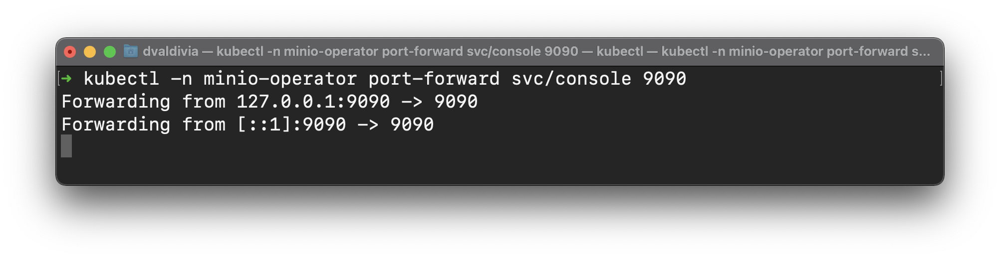
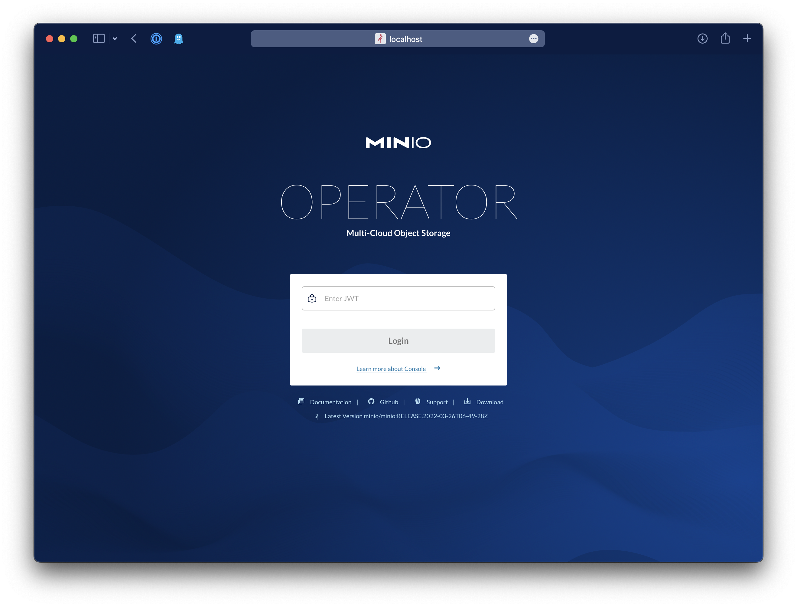
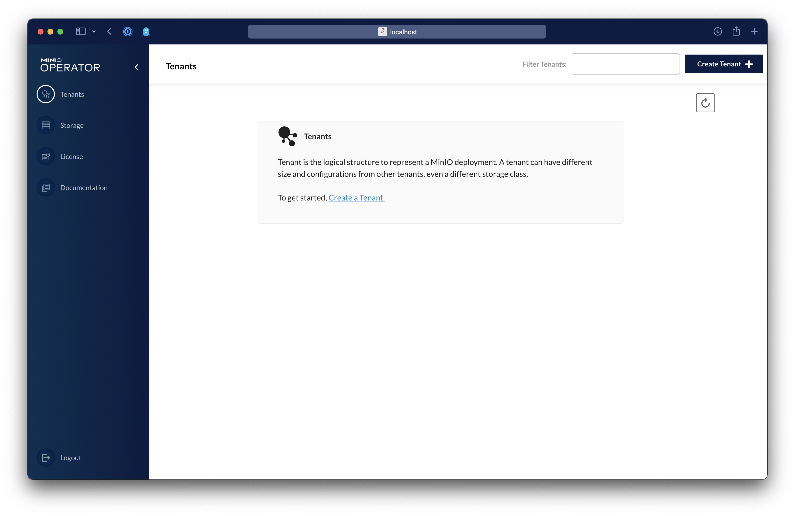
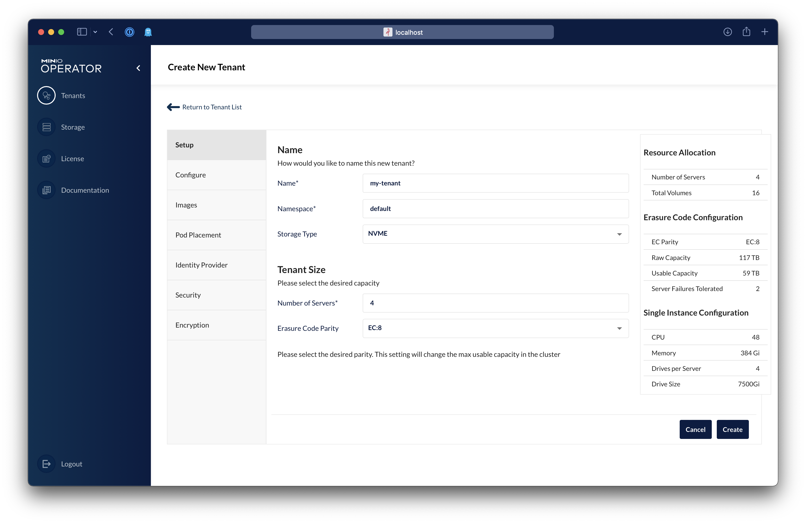

# Setting up MinIO on AWS EKS

The following steps will guide you through setting up a dedicated EKS Cluster for MinIO, if you have an existing EKS
cluster and would like to manage MinIO via Node Groups [follow these instructions instead](existing-eks-cli-simple.md).

## Pre-requisites

> ⚠️ **You must create a subcription in the [AWS Marketplace](https://aws.amazon.com/marketplace/pp/prodview-smchi7bcs4nn4) for MinIO else the automation from this setup won't work due to a missing entitlement.**


Additionally:

* [awscli](https://aws.amazon.com/cli/)
* [kubectl](https://kubernetes.io/docs/tasks/tools/)
* [eksctl](https://eksctl.io/introduction/#installation)

## 0.- Before you start

You are going to need three basic configuration parameters for your cluster

`Account Number` can be obtained from the AWS Console or by running the following command

```shell
export AWS_ACCOUNT_NUMBER=`aws sts get-caller-identity --query "Account" --output text` 
echo $AWS_ACCOUNT_NUMBER
```

Decide a `region` for example `us-west-2`

Pick a `Cluster Name`, for example `minio-cluster`

## 1.- Setup cluster

### 1.1.1- New Cluster

Replace the `<CLUSTER_NAME>` in the following command, then execute:

```shell
 eksctl create cluster \
--name <CLUSTER_NAME> \
--version 1.21 \
--node-type=c6gn.16xlarge \
--nodes-min=4 \
--nodes=4 \
--nodes-max=4 --zones=us-west-2a,us-west-2b,us-west-2c
```

### 1.1.2- Existing cluster

You can use any existing cluster as long as you install
the [AWS EBS CSI Driver](https://github.com/kubernetes-sigs/aws-ebs-csi-driver)

### 1.2 - Install the AWS EBS CSI Driver

The [AWS EBS CSI Driver](https://github.com/kubernetes-sigs/aws-ebs-csi-driver) is needed to use `gp3` and `sc1` type of
storage inside EKS.

## 2.- Setup required Roles, Policies and Connectors

All of these are scoped to the specific cluster called `Cluster Name` on `region` on the given `account number`, so make
sure to update those values

### 2.1 Create IAM Policy

Replace the `<CLUSTER_NAME>` and `<AWS_ACCOUNT_NUMBER>` in the `iam-policy.json` file

```shell
aws iam create-policy \
  --policy-name minio-eks-<CLUSTER_NAME> \
  --policy-document file://iam-policy.json
```

### 2.3 Create a OIDC Provider

```shell
eksctl utils associate-iam-oidc-provider --region=us-west-2 --cluster=<CLUSTER_NAME> --approve
```

### 2.2 Create Trust + Role + Service Account

```shell
eksctl create iamserviceaccount \
    --name minio-operator \
    --namespace minio-operator \
    --cluster <CLUSTER_NAME> \
    --attach-policy-arn arn:aws:iam::<AWS_ACCOUNT_NUMBER>:policy/minio-eks-<CLUSTER_NAME> \
    --approve \
    --override-existing-serviceaccounts
```

Install the Service account for the `AWS EBS CSI Driver`

```shell
eksctl create iamserviceaccount \
    --name ebs-csi-controller-sa \
    --namespace kube-system \
    --cluster <CLUSTER_NAME> \
    --attach-policy-arn arn:aws:iam::<AWS_ACCOUNT_NUMBER>:policy/minio-eks-<CLUSTER_NAME> \
    --approve \
    --override-existing-serviceaccounts
```

### 2.3 Install the AWS EBS CSI Driver

```shell
kubectl apply -k "github.com/kubernetes-sigs/aws-ebs-csi-driver/deploy/kubernetes/overlays/stable/?ref=release-1.5"
```

## 3.- Install Operator

```shell
kubectl apply -k github.com/miniohq/marketplace/eks/resources 
```

### 3.1- Get the JWT to login to Operator UI

```shell
kubectl -n minio-operator  get secret $(kubectl -n minio-operator get serviceaccount console-sa -o jsonpath="{.secrets[0].name}") -o jsonpath="{.data.token}" | base64 --decode 
```



## 4.- Port Forward into Operator UI

```shell
kubectl -n minio-operator port-forward svc/console 9090
```



### 4.1 - Open the UI and create a Tenant

Go to http://localhost:9090 enter the JWT from the previous step and create a tenant.



Now click on `Create Tenant`



Fill in the desired size of the MinIO Tenant and the storage type



## 5.- Sign Up for MinIO Subscription Network

To receive support send us an email to subnet@min.io which includes your `AWS Account Number` to get started and receive
24/7 support.
