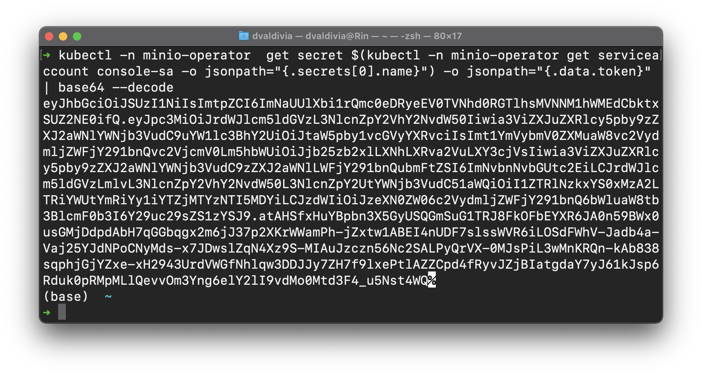
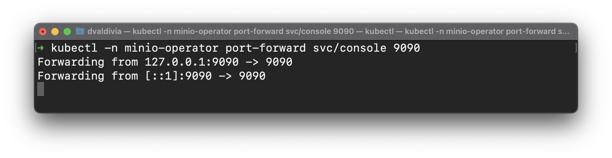
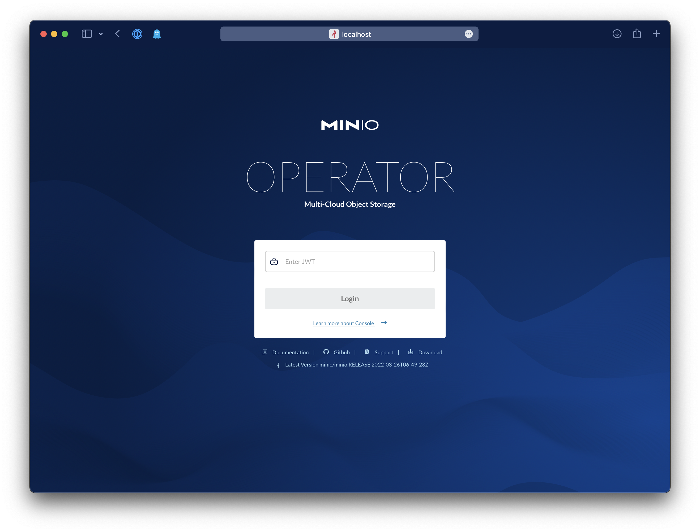

# Setting up MinIO on AWS EKS

The following steps will guide you through setting up MinIO on AWS EKS

## Pre-requisites

> ⚠️ **You must create a subcription in the [AWS Marketplace](https://aws.amazon.com/marketplace/pp/prodview-smchi7bcs4nn4) for MinIO else the automation from this setup won't work due to a missing entitlement.**


Additionally:

* [awscli](https://aws.amazon.com/cli/)
* [kubectl](https://kubernetes.io/docs/tasks/tools/)

## 0.- Before you start

You are going to need three basic configuration parameters for your cluster

`Account Number` can be obtained from the AWS Console or by running the following command

```shell
export AWS_ACCOUNT_NUMBER=`aws sts get-caller-identity --query "Account" --output text` 
echo $AWS_ACCOUNT_NUMBER
```

Decide a `region` for example `us-west-2`

Pick a `Cluster Name`, for example `minio-cluster`

## 1.- Install the MinIO Operator with the AWS Integration

The following command will instal the MinIO Operator with just kubectl.

```shell
kubectl apply -k github.com/miniohq/marketplace/eks/resources 
```

**Note:** Any existing MinIO Operator will be upgraded/patched to the **Marketplace Stable release**.

## 2.- Setup required Roles, Policies and Connectors

All of these are scoped to the specific cluster called `Cluster Name` on `region` on the given `account number`, so make
sure to update those values in the sample files.

### 2.1 (Optional) Create an OIDC Provider for your cluster

If you have not create an OIDC Provider for your cluster yet, you need to do so by following the AWS documentation
to [Create an IAM OIDC provider for your cluster.](https://docs.aws.amazon.com/eks/latest/userguide/enable-iam-roles-for-service-accounts.html)
This only need to be done once per cluster.

### 2.2 Create IAM Policy

```shell
aws iam create-policy \
  --policy-name minio-eks-<CLUSTER_NAME>-marketplace \
  --policy-document file://iam-policy-existing-eks.json
```

### 2.3 Create an IAM Role

Get your account number

```shell
ACCOUNT_ID=$(aws sts get-caller-identity --query "Account" --output text)
```

Get your OIDC provider

```shell
OIDC_PROVIDER=$(aws eks describe-cluster --name <CLUSTER_NAME> --query "cluster.identity.oidc.issuer" --output text | sed -e "s/^https:\/\///")
```

Create a role for the `minio-operator` service account in the `minio-operator` namespace.

```shell
read -r -d '' TRUST_RELATIONSHIP <<EOF
{
  "Version": "2012-10-17",
  "Statement": [
    {
      "Effect": "Allow",
      "Principal": {
        "Federated": "arn:aws:iam::${ACCOUNT_ID}:oidc-provider/${OIDC_PROVIDER}"
      },
      "Action": "sts:AssumeRoleWithWebIdentity",
      "Condition": {
        "StringEquals": {
          "${OIDC_PROVIDER}:sub": "system:serviceaccount:minio-operator:minio-operator"
        }
      }
    }
  ]
}
EOF
echo "${TRUST_RELATIONSHIP}" > trust.json
```

Create the role

```shell
aws iam create-role --role-name minio-<CLUSTER_NAME>-role --assume-role-policy-document file://trust.json --description "Role used by MinIO"
```

Attach the policy we create before to the role

```shell
aws iam attach-role-policy --role-name minio-<CLUSTER_NAME>-role --policy-arn=arn:aws:iam::<AWS_ACCOUNT_NUMBER>:policy/minio-eks-<CLUSTER_NAME>-marketplace
```

Patch the MinIO Operator service account with the role

```shell
kubectl -n minio-operator annotate serviceaccount minio-operator eks.amazonaws.com/role-arn=arn:aws:iam::804065449417:role/minio-marketplace-existing-setup-role
```

## 3.- Create Launch Template for node groups

We use the following Launch Template to format and mount all the local devices on your instances in the node group, so
create a launch template and attach it to any node group being created for MinIO

```shell
aws ec2 create-launch-template --launch-template-name minio-marketplace-launch-template --version-description version1 \
--launch-template-data '{"UserData":"TUlNRS1WZXJzaW9uOiAxLjAKQ29udGVudC1UeXBlOiBtdWx0aXBhcnQvbWl4ZWQ7IGJvdW5kYXJ5PSI9PU1ZQk9VTkRBUlk9PSIKCi0tPT1NWUJPVU5EQVJZPT0KQ29udGVudC1UeXBlOiB0ZXh0L3gtc2hlbGxzY3JpcHQ7IGNoYXJzZXQ9InVzLWFzY2lpIgoKIyEvYmluL2Jhc2gKI3NldCAteAoKbW91bnRfZGV2aWNlKCl7CkRFVklDRT0iL2Rldi8kMSIKVk9MVU1FX05BTUU9JDIKTU9VTlRfUE9JTlQ9JDMKCmZvcm1hdF9kZXZpY2UoKSB7CiAgZWNobyAiRm9ybWF0dGluZyAkREVWSUNFIgogIG1rZnMueGZzIC1pbWF4cGN0PTI1IC1mIC1MICRNT1VOVF9QT0lOVCAkREVWSUNFCn0KY2hlY2tfZGV2aWNlKCkgewogIGlmIFsgLWYgIi9ldGMvc3lzdGVtZC9zeXN0ZW0vJE1PVU5UX1BPSU5ULm1vdW50IiBdOyB0aGVuCiAgICBlY2hvICJEZXZpY2UgJE1PVU5UX1BPSU5UICgkREVWSUNFKSBleGlzdHMiCiAgICBlY2hvICJObyBhY3Rpb25zIHJlcXVpcmVkLi4uIgogIGVsc2UKICAgIGVjaG8gIiRNT1VOVF9QT0lOVC5tb3VudCB3YXMgbm90IGZvdW5kLCBjcmVhdGluZyB2b2x1bWUiCiAgICBmb3JtYXRfZGV2aWNlCiAgZmkKfQpjaGVja19tb3VudCgpIHsKICBpZiBbIC1mICIvZXRjL3N5c3RlbWQvc3lzdGVtLyRNT1VOVF9QT0lOVC5tb3VudCIgXTsgdGhlbgogICAgZWNobyAiRm91bmQgJE1PVU5UX1BPSU5ULm1vdW50IGluIC9ldGMvc3lzdGVtZC9zeXN0ZW0vIgogICAgZWNobyAiTm8gYWN0aW9ucyByZXF1aXJlZC4uLiIKICBlbHNlCiAgICBlY2hvICIkTU9VTlRfUE9JTlQubW91bnQgd2FzIG5vdCBmb3VuZCBpbiAvZXRjL3N5c3RlbWQvc3lzdGVtLyBhZGRpbmcgaXQiCiAgICBta2RpciAtcCAvJE1PVU5UX1BPSU5UCgogICAgZWNobyAiW1VuaXRdIiA+PiAvZXRjL3N5c3RlbWQvc3lzdGVtLyRNT1VOVF9QT0lOVC5tb3VudAogICAgZWNobyAiRGVzY3JpcHRpb249TW91bnQgU3lzdGVtIEJhY2t1cHMgRGlyZWN0b3J5IiA+PiAvZXRjL3N5c3RlbWQvc3lzdGVtLyRNT1VOVF9QT0lOVC5tb3VudAogICAgZWNobyAiIiA+PiAvZXRjL3N5c3RlbWQvc3lzdGVtLyRNT1VOVF9QT0lOVC5tb3VudAogICAgZWNobyAiW01vdW50XSIgPj4gL2V0Yy9zeXN0ZW1kL3N5c3RlbS8kTU9VTlRfUE9JTlQubW91bnQKICAgIGVjaG8gIldoYXQ9TEFCRUw9JE1PVU5UX1BPSU5UIiA+PiAvZXRjL3N5c3RlbWQvc3lzdGVtLyRNT1VOVF9QT0lOVC5tb3VudAogICAgZWNobyAiV2hlcmU9LyRNT1VOVF9QT0lOVCIgPj4gL2V0Yy9zeXN0ZW1kL3N5c3RlbS8kTU9VTlRfUE9JTlQubW91bnQKICAgIGVjaG8gIlR5cGU9eGZzIiA+PiAvZXRjL3N5c3RlbWQvc3lzdGVtLyRNT1VOVF9QT0lOVC5tb3VudAogICAgZWNobyAiT3B0aW9ucz1ub2F0aW1lIiA+PiAvZXRjL3N5c3RlbWQvc3lzdGVtLyRNT1VOVF9QT0lOVC5tb3VudAogICAgZWNobyAiIiA+PiAvZXRjL3N5c3RlbWQvc3lzdGVtLyRNT1VOVF9QT0lOVC5tb3VudAogICAgZWNobyAiW0luc3RhbGxdIiA+PiAvZXRjL3N5c3RlbWQvc3lzdGVtLyRNT1VOVF9QT0lOVC5tb3VudAogICAgZWNobyAiV2FudGVkQnk9bXVsdGktdXNlci50YXJnZXQiID4+IC9ldGMvc3lzdGVtZC9zeXN0ZW0vJE1PVU5UX1BPSU5ULm1vdW50CgogICAgc3lzdGVtY3RsIGVuYWJsZSAkTU9VTlRfUE9JTlQubW91bnQKICAgIHN5c3RlbWN0bCBzdGFydCAkTU9VTlRfUE9JTlQubW91bnQKICBmaQp9CkxBQkVMPSQoYmxraWQgLUwgJFZPTFVNRV9OQU1FKQpjaGVja19kZXZpY2UKY2hlY2tfbW91bnQKc3lzdGVtY3RsIGRhZW1vbi1yZWxvYWQKfQoKZm9yIGkgaW4gYGxzYmxrIC1kIHwgZ3JlcCAtdiBOQU1FIHwgZ3JlcCAtdiBudm1lMCB8IGF3ayAne3ByaW50ICQxfSdgOyBkbwogIG1udF9wb2ludD1gZWNobyAkaSB8IHNlZCAtZSAncy9udm1lL2Rpc2svZycgLWUgJ3MvbjEvL2cnYAogIG1vdW50X2RldmljZSAkaSAkaSAkbW50X3BvaW50Owpkb25lCgoKLS09PU1ZQk9VTkRBUlk9PS0tXFw="}'
```

### 3.1- Create Node Group

Create a node group, preferable an instance of type either `i3en` for NVMe or `d3en` for HDD storage, but make sure to
label your nodes with the following label

```yaml
...
labels:
  alpha.min.io/local-storage: nodegroup-name
```

### 4- Get the JWT to login to Operator UI

```shell
kubectl -n minio-operator  get secret $(kubectl -n minio-operator get serviceaccount console-sa -o jsonpath="{.secrets[0].name}") -o jsonpath="{.data.token}" | base64 --decode 
```



## 4.1- Port Forward into Operator UI

```shell
kubectl -n minio-operator port-forward svc/console 9090
```



### 4.1 - Open the UI and create a Tenant

Go to http://localhost:9090 enter the JWT from the previous step and create a tenant.



Now click on `Create Tenant`


Fill in the desired size of the MinIO Tenant and the storage type


## 5.- Sign Up for MinIO Subscription Network

To receive support send us an email to subnet@min.io which includes your `AWS Account Number` to get started and receive
24/7 support.
